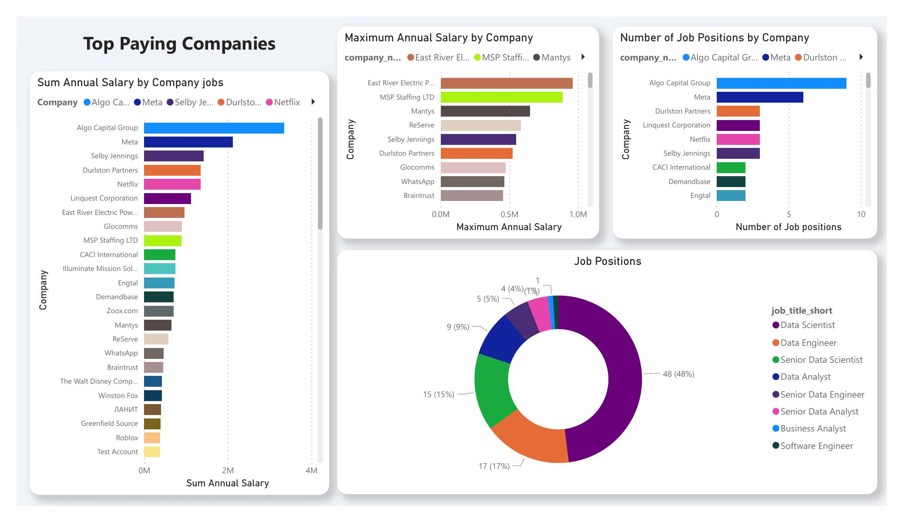
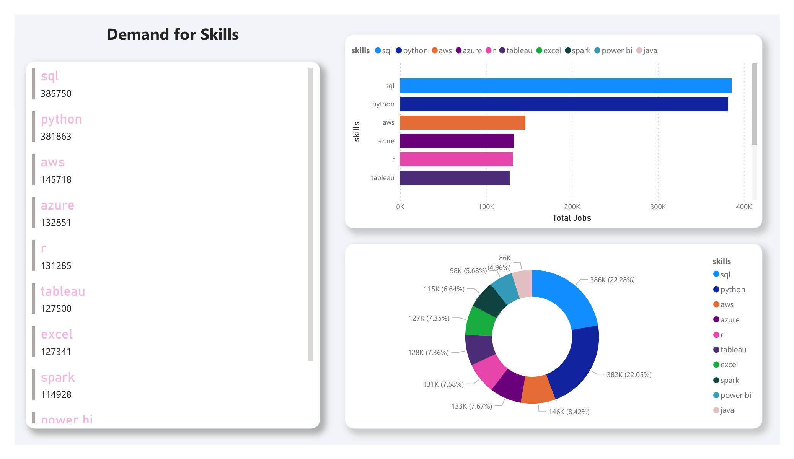
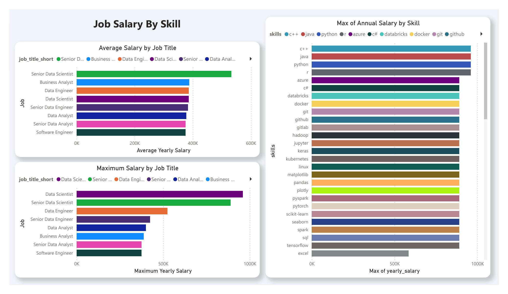
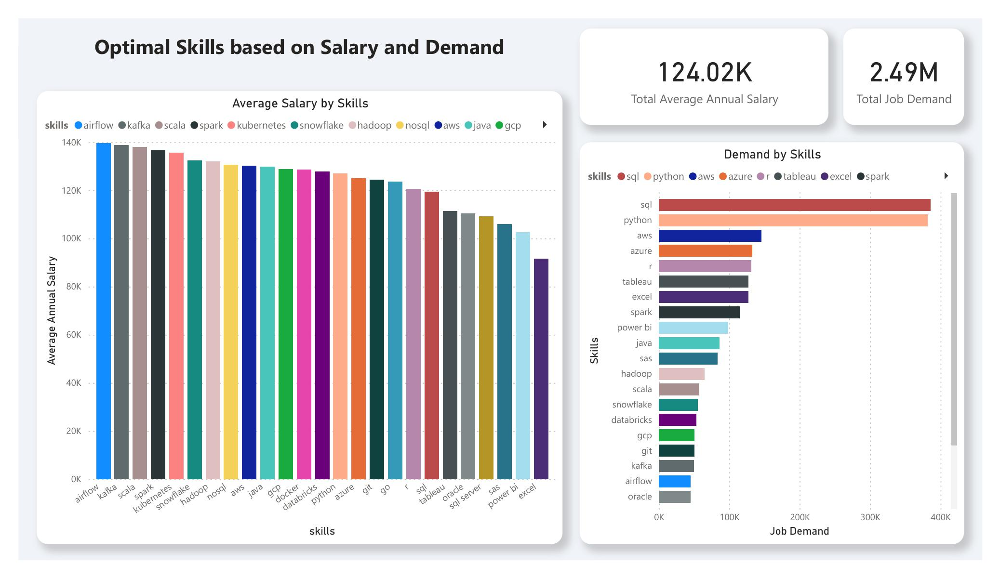
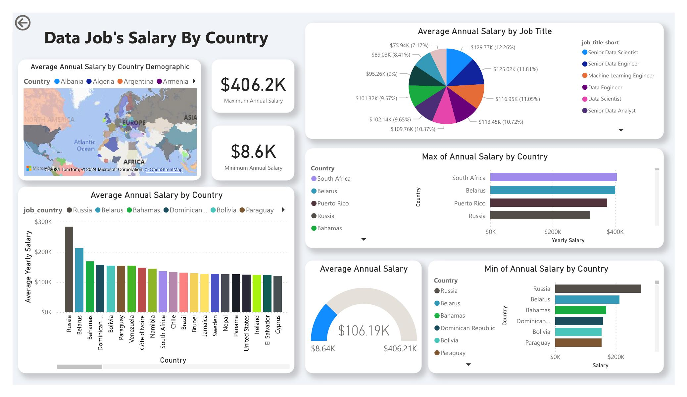

# Introduction
💡 Explore the data job Market! Focusing on the 'data' and 'Software' roles. This projects explore the top paying countries, top paying jobs, top paying skills, in demand skills, and top optimal skills which meets high demand and high salary.

- 🔍 SQL queries? check them out here: [project_sql folder](/project_sql/)
- 📊 Dashboards? check them out here: [Dashboard folder](/Dashboard/)
# Background
💹 The motive behind this project is knowing the top paid and in demand skills, along side the salaries of jobs around the globe.

Data hails from [Luke's SQL Course](https://www.lukebarousse.com/sql).

### Questions I wanted to answer through my queries:

1) what are the top paying data jobs?
2) what are the most in demand skills?
3) what are the top skills based on salary?
4) what are the most optimal skills to learn (High demand and high paying)?
5) what are the top paying countries?

# Used Tools
- **SQL**: The backbone of my analysis, allowing me ti extract useful result sets.
- **PostgreSQL**: The Chosen DBMS for handling my data
- **Power BI**: The main dashboarding and data visualisation tool for my analysis
- **Git & GitHub**: I used github for version control.

# The Analysis
### 1. Top paying data jobs
To identify the answer I needed to calculate the average annual salary and focusing on the company name, its annual salary, and its job title.

- **Query:**
``` SQL
SELECT 
    job_id,
    name AS company_name,
    job_title_short,
    job_title,
    job_location,
    job_schedule_type,
    job_posted_date,
    CASE
        WHEN salary_hour_avg IS NOT NULL 
            THEN CASE 
                WHEN job_schedule_type = 'Full-time' THEN salary_hour_avg * 40 * 4 * 12
                WHEN job_schedule_type = 'Part-time' THEN  salary_hour_avg * 20 * 4 * 12
            END
        ELSE salary_year_avg
    END AS yearly_salary
FROM job_postings_fact
LEFT JOIN company_dim
ON job_postings_fact.company_id = company_dim.company_id
WHERE
(
    salary_year_avg IS NOT NULL OR salary_hour_avg IS NOT NULL
) AND (
    job_schedule_type = 'Full-time' OR job_schedule_type = 'Part-time'
)
ORDER BY yearly_salary DESC
LIMIT 100;
```
- **Dashboard:**


### 2. Top Demanded Skills
To know the most demanded skills, I needed to focus on the count of the jobs needed for each skill and ordering them by the highest job count

- **Query:**
``` SQL
SELECT
    skills,
    COUNT(*) AS job_count
FROM job_postings_fact
INNER JOIN skills_job_dim 
ON job_postings_fact.job_id = skills_job_dim.job_id
INNER JOIN skills_dim 
ON skills_job_dim.skill_id = skills_dim.skill_id
GROUP BY skills
ORDER BY job_count DESC
LIMIT 100;
```
- **Dashboard:**


### 3. Top skills based on salary
Here I focused on the job's salary and joining it with the skills, also calculating other useful infos in Power BI like the maximum, and average salaries based on skills and the job title.

- **Query:**
``` SQL
SELECT 
    skills,
    ROUND(AVG(CASE
        WHEN salary_hour_avg IS NOT NULL 
            THEN CASE 
                WHEN job_schedule_type = 'Full-time' THEN salary_hour_avg * 40 * 4 * 12
                WHEN job_schedule_type = 'Part-time' THEN  salary_hour_avg * 20 * 4 * 12
            END
        ELSE salary_year_avg
    END), 0) AS yearly_salary_avg
FROM job_postings_fact
INNER JOIN skills_job_dim 
ON job_postings_fact.job_id = skills_job_dim.job_id
INNER JOIN skills_dim 
ON skills_job_dim.skill_id = skills_dim.skill_id
WHERE 
    (salary_hour_avg IS NOT NULL OR salary_year_avg IS NOT NULL) AND
    (job_schedule_type = 'Full-time' OR job_schedule_type = 'Part-time')
GROUP BY skills
ORDER BY yearly_salary_avg DESC;
```
- **Dashboard:**

### 4. most optimal skills to learn (High demand and high paying):
In here I focused on my query on extracting 3 columns, the skill, its average annual salary, and its job count. its like combining the previous 2 results into one result to know which skill has both high demand and high paying.

- **Query:**
``` SQL
WITH CTE_skill_per_job AS(
SELECT
    skills,
    COUNT(*) AS job_count
FROM job_postings_fact
INNER JOIN skills_job_dim 
ON job_postings_fact.job_id = skills_job_dim.job_id
INNER JOIN skills_dim 
ON skills_job_dim.skill_id = skills_dim.skill_id
GROUP BY skills
ORDER BY job_count DESC), CTE_skill_per_avg_salary AS(
SELECT 
    skills,
    ROUND(AVG(CASE
        WHEN salary_hour_avg IS NOT NULL 
            THEN CASE 
                WHEN job_schedule_type = 'Full-time' THEN salary_hour_avg * 40 * 4 * 12
                WHEN job_schedule_type = 'Part-time' THEN  salary_hour_avg * 20 * 4 * 12
            END
        ELSE salary_year_avg
    END), 0) AS yearly_salary_avg
FROM job_postings_fact
INNER JOIN skills_job_dim 
ON job_postings_fact.job_id = skills_job_dim.job_id
INNER JOIN skills_dim 
ON skills_job_dim.skill_id = skills_dim.skill_id
WHERE 
    (salary_hour_avg IS NOT NULL OR salary_year_avg IS NOT NULL) AND
    (job_schedule_type = 'Full-time' OR job_schedule_type = 'Part-time')
GROUP BY skills
ORDER BY yearly_salary_avg DESC
)

SELECT
    CTE_skill_per_avg_salary.skills,
    job_count,
    yearly_salary_avg
FROM CTE_skill_per_job
INNER JOIN CTE_skill_per_avg_salary
ON CTE_skill_per_job.skills = CTE_skill_per_avg_salary.skills
ORDER BY
    job_count DESC,
    yearly_salary_avg DESC
LIMIT 25;
```
- **Dashboard:**


### 5. Top paying countries
I was curious about the salaries in different countries. So I focused on the job location, salary,  and job title. Also applying demographics, max, min, average salary for the countries.

- **Query:**
``` SQL
SELECT 
    job_title_short,
    job_country,
    ROUND(AVG(CASE
        WHEN salary_hour_avg IS NOT NULL 
            THEN CASE 
                WHEN job_schedule_type = 'Full-time' THEN salary_hour_avg * 40 * 4 * 12
                WHEN job_schedule_type = 'Part-time' THEN  salary_hour_avg * 20 * 4 * 12
            END
        ELSE salary_year_avg
    END), 2) AS yearly_salary
FROM job_postings_fact
LEFT JOIN company_dim
ON job_postings_fact.company_id = company_dim.company_id
WHERE
(
    salary_year_avg IS NOT NULL OR salary_hour_avg IS NOT NULL
) AND (
    job_schedule_type = 'Full-time' OR job_schedule_type = 'Part-time'
)
GROUP BY job_title_short, job_country
ORDER BY yearly_salary DESC;
```

- **Dashboard:**


# Conclusions

1) **Top paying data jobs**: The highest paying company with also many job posting was the Algo Capital Group and the most in demand job position was Data Science.
2) **Most in demand skills**: SQL made it as the number one skill in demand for the job market followed by python as SQL slightly surpass it making them to be the most demanded skills in the job market. 
3) **Top skills based on salary**: Here the top 4 skills are c++, java, python and r. All sharing the number 1 for the highest maximum salary but most of them having segnificantly low demand for jobs. Also adding that Data Scientists having the highest salaries of all jobs. 
4) **Optimal skills to learn (High demand and high paying)**: Based on the analysis, SQL and Python are by far the most optimal skills to learn, although they did not make the top of the average salary graph but their very high demand makes them come at the top of the list.
5) **Top paying countries**: These results were surprisingly for me, although the US having the highest job count on the list, but the highest maximum Salary was for South Africa and the highest average annual salary was for Russia. Also I don't recomend applying jobs in Zimbabwe, since it is at the bottom of the list. 
